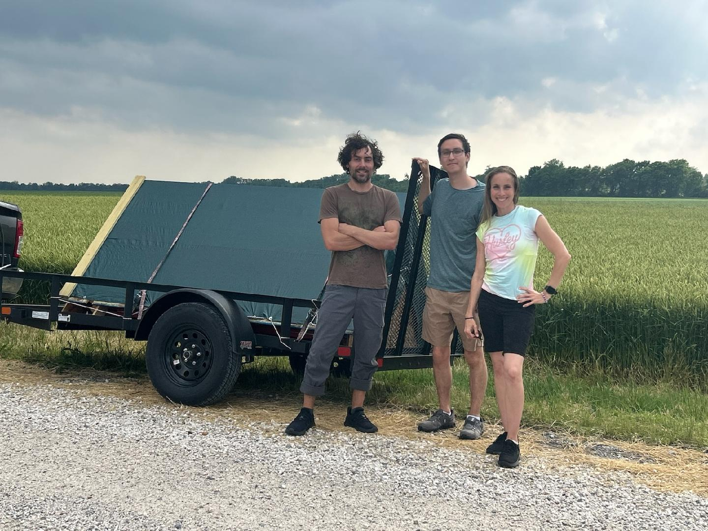
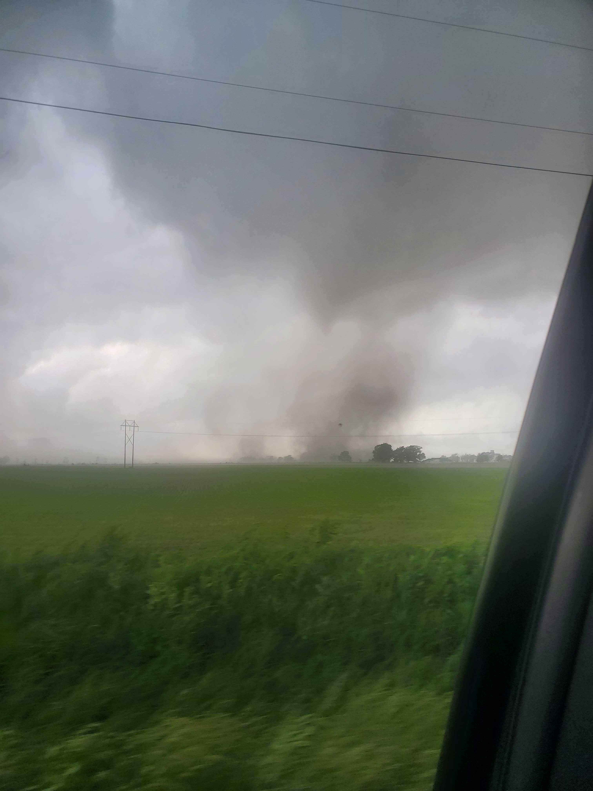
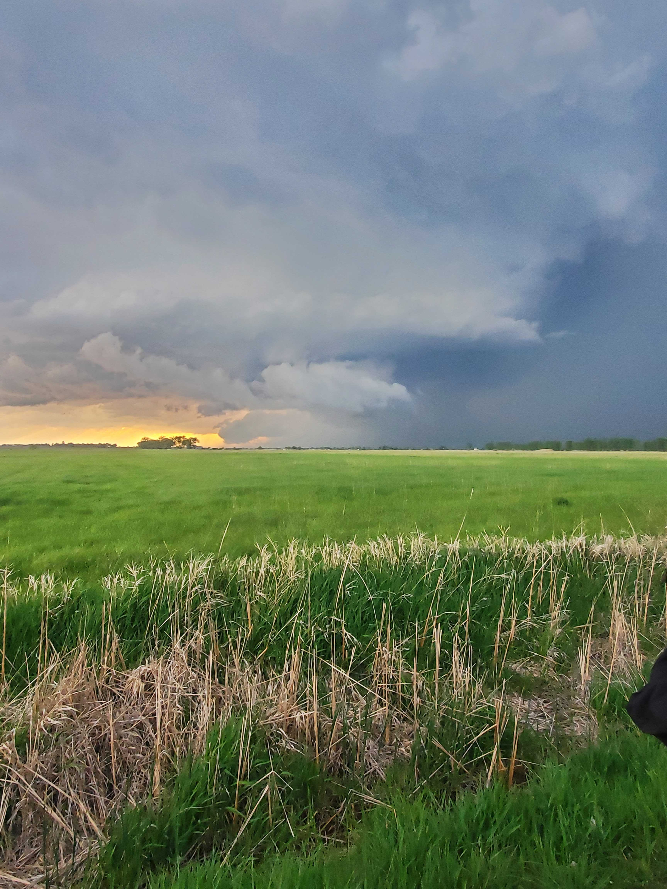

Hi! I'm Will. I am currently a postdoctoral fellow at the Center for Cosmology and Astroparticle Physics at Ohio State. My research covers a broad range of topics, ranging from neutrino astronomy with the IceCube detector at the South Pole, to using cosmic rays to observe tornadic storms. 

[CV](cv_med.pdf)

[Resume](resume.pdf)

Pictures from Tornado Deployment
======
I am a somewhat poor photographer, but some of the other people who were on this trip got far better pictures. If you'd like to see/learn more, feel free to contact me!

